# Discovery Report — Halo Fire Protection

## Client Info

- **Company:** Halo Fire Protection
- **Industry:** fire protection
- **Email:** dallasteele@me.com
- **Status:** discovery
- **Discovery Date:** 2026-03-16T08:22:12.389447

## Analysis

# Business Automation Discovery Report
## Halo Fire Protection — Multi-State Fire Sprinkler Operations

**Client:** Dallas Steele, CEO — Halo Fire Protection
**Date:** March 2026
**Prepared by:** HAL Automation Services

---

## Executive Summary

Halo Fire Protection operates fire sprinkler installation, inspection, testing, maintenance, and backflow testing services across 30 states from its Mesa, AZ headquarters. With 45 employees — including field technicians, project managers, dispatchers, and office staff — the company manages thousands of active fire protection systems under jurisdiction-specific compliance schedules.

Three critical bottlenecks are consuming significant time and creating risk: manual compliance tracking across a 30-state patchwork of AHJ requirements, a fully-manual bid and proposal process, and the absence of a self-service portal for the property managers who are Halo Fire's primary repeat customers.

Automating these three areas is projected to save **160–220 hours per month** in staff time and materially reduce compliance exposure.

---

## Current Technology Stack

| System | Role | Integration Potential |
|---|---|---|
| **ServiceTitan** | Field dispatch, job management, scheduling | Full API — bi-directional sync |
| **QuickBooks** | Invoicing, accounting, payroll | API — invoice push from ServiceTitan |
| **Spreadsheets** | Compliance tracking, bid takeoffs | Replace entirely |
| **Word / PDF** | Proposal generation | Automate output from structured data |

ServiceTitan is the operational core and the best integration anchor point. All automation modules should treat ServiceTitan as the system of record for jobs and technician data.

---

## Pain Point 1: Multi-State Compliance Tracking

### Current State
Halo Fire monitors thousands of fire protection systems across 30 states. Each state has its own AHJ (Authority Having Jurisdiction) requirements layered on top of NFPA 25 — inspection intervals, documentation formats, technician certification requirements, and reporting obligations vary by state and sometimes by municipality. This is tracked manually in spreadsheets by office staff.

### Risks and Costs
- Missed inspection deadlines create liability exposure and can void customer insurance coverage
- Non-compliance with state-specific certifications exposes Halo Fire to contractor license risk
- Dispatcher must manually verify tech certifications for each state on every assignment — error-prone at 30-state scale
- Re-inspection scheduling after deficiency repairs is an entirely manual loop

### Proposed Module: **HaloCompliance Engine**

**What it does:**
- Maintains a database of all Halo Fire-serviced systems — property, system type, last inspection date, next due date, state jurisdiction, and applicable NFPA/AHJ standard
- Tracks technician certifications per state (integrated with ServiceTitan tech profiles)
- Auto-generates inspection work orders in ServiceTitan 30/60/90 days before due dates
- Flags dispatch assignments where the assigned tech lacks the required state certification
- Tracks open deficiencies from failed inspections through repair authorization to re-inspection closeout
- Posts compliance certificates to the customer portal automatically upon passing inspection
- Sends AHJ notifications where required by state law (configurable per jurisdiction)

**Integration:** ServiceTitan API (jobs, technicians, customers) + state certification registry data

**Estimated savings:** 30–40 hours/month for office staff currently managing compliance spreadsheets. Risk reduction on missed deadlines is the bigger win — even one avoided re-inspection or licensing incident pays for the system.

---

## Pain Point 2: Bid Management — Takeoffs and Proposals

### Current State
When a general contractor or building owner sends Halo Fire a set of building plans, a project manager manually performs a takeoff — counting sprinkler heads, measuring pipe runs, identifying device types — and records everything in a spreadsheet. Material pricing is pulled from supplier catalogs, labor is estimated by state (prevailing wage rules vary), and a proposal is assembled in Word and exported to PDF. A full bid can take 4–8 hours of a PM's time.

### Risks and Costs
- PMs spend roughly 60% of their time on bids rather than managing active jobs
- Manual takeoffs have a 5–15% error rate, which erodes margin on awarded jobs
- No systematic tracking of bid-to-award ratios by project type, state, or GC — can't identify where Halo Fire is competitive
- Proposal formatting is inconsistent — presentation quality varies by who assembles it

### Proposed Module: **HaloBid Pro**

**What it does:**
- PDF/CAD plan ingestion with AI-assisted head count and zone identification (flags for PM review rather than replacing judgment)
- Structured material list builder linked to supplier pricing — prices auto-refresh from catalog feeds
- Labor estimation engine with state-specific prevailing wage rules baked in (30 states configured at launch)
- Professional proposal generator: pulls structured data into a branded Halo Fire PDF template with cover page, scope of work, material schedule, and pricing
- Bid tracking dashboard: tracks submission date, awarded/lost, contract value, and win rate by state/GC/project type
- CEO approval workflow: PM completes bid → routed to CEO for review before submission

**Integration:** ServiceTitan (convert awarded bid to project), QuickBooks (link contract value to revenue forecast)

**Estimated savings:** 3–4 hours per bid × estimated 15–20 bids/month = **45–80 hours/month** saved for project managers. Proposal quality improvement and faster turnaround times increase win rates — a 5% improvement in win rate on Halo Fire's typical project size has significant revenue impact.

---

## Pain Point 3: Customer Portal for Property Managers

### Current State
Property managers — Halo Fire's core repeat customers — currently get compliance status and schedule information through phone calls and emails with Halo Fire's office staff. Requesting inspections, reviewing deficiency reports, authorizing repairs, and downloading compliance certificates all require human touchpoints on both sides.

### Risks and Costs
- Office staff spend 15–25 hours/week fielding status calls and sending documents
- Property managers managing large portfolios (e.g., REITs, property management firms with 50+ properties) are underserved — they need bulk compliance visibility
- Manual certificate delivery delays compliance reporting for property managers who need it for insurance renewals and AHJ submittals

### Proposed Module: **HaloPortal**

**What it does:**
- Property manager login with access code (multi-property portfolio view)
- Compliance dashboard: all serviced systems, inspection status (current/due/overdue), open deficiencies, and certificate status at a glance
- Self-service inspection requests: PM clicks to request inspection → auto-creates work order in ServiceTitan → PM gets confirmation with scheduled window
- Deficiency management: view inspection report, see photos and tech notes, authorize repair in one click
- Document center: download compliance certificates, inspection reports, and AHJ submissions as PDFs
- Service request portal: submit new service requests (new installation, backflow testing, maintenance) with property details pre-filled from account

**Integration:** ServiceTitan (real-time job/certificate sync), HaloCompliance Engine (compliance status feed)

**Estimated savings:** 15–25 hours/month in office staff communication time. More importantly, this is a competitive differentiator — property management firms that manage large portfolios will choose contractors who give them self-service visibility over those that don't.

---

## Staffing Impact Summary

| Role | Current Manual Time/Month | Estimated Savings/Month |
|---|---|---|
| Office staff (compliance tracking) | ~120 hrs | 30–40 hrs |
| Project managers (bid prep) | ~80–120 hrs | 45–80 hrs |
| Dispatchers (cert verification) | ~20 hrs | 10–15 hrs |
| Office staff (portal comm.) | ~60–100 hrs | 15–25 hrs |
| **Total** | **280–340 hrs** | **100–160 hrs** |

At a fully-loaded cost of $35–50/hr for office/PM staff, this represents **$3,500–$8,000/month** in recoverable labor — before accounting for reduced compliance risk, higher bid win rates, and the competitive advantage of a professional customer portal.

---

## Recommended Build Sequence

### Phase 1 — HaloCompliance Engine (Months 1–2)
Highest risk reduction. Replaces the compliance spreadsheets with a real database, integrates with ServiceTitan for job creation, and adds cert-check to dispatch. Delivers immediate operational value and protects the business from compliance exposure.

### Phase 2 — HaloBid Pro (Months 2–4)
Highest PM time recovery. Start with the proposal generator and labor estimation engine (immediate gains), then layer in the AI-assisted takeoff module once the data structure is proven. Bid tracking dashboard launches with Phase 2.

### Phase 3 — HaloPortal (Months 4–6)
Leverages the foundation built in Phases 1–2. Compliance data from Phase 1 feeds the portal dashboard. Deficiency management and certificate delivery become straightforward once the compliance engine is live. Position this for Halo Fire's largest portfolio clients first.

---

## Next Steps

1. **ServiceTitan API access** — HAL needs read/write API credentials to map Halo Fire's existing tech profiles, certification data, and job history
2. **Compliance spreadsheet export** — Share current compliance tracking spreadsheets to map all active systems, jurisdictions, and due dates for migration
3. **Sample bid package** — Provide 2–3 recent proposals (redacted if needed) to understand the current output format and material structure
4. **Priority customer list** — Identify 2–3 property manager clients who would be early adopters of HaloPortal for initial rollout feedback

---

*Report generated from discovery session with Dallas Steele, Halo Fire Protection. All automation modules are custom-built for Halo Fire's workflows — not off-the-shelf software requiring a new subscription.*

## Process Diagram

```mermaid
graph TD
    subgraph Compliance["Multi-State Compliance Lifecycle"]
        C1[Property Manager / AHJ requires inspection] --> C2[Compliance tracker checks due date]
        C2 --> C3{State jurisdiction rules?}
        C3 -->|NFPA 25 standard| C4[Schedule inspection window]
        C3 -->|State-specific variant| C5[Apply jurisdiction override rules]
        C4 --> C6[Assign certified tech for that state]
        C5 --> C6
        C6 --> C7[Field technician performs inspection]
        C7 --> C8{Pass / Fail?}
        C8 -->|Pass| C9[Generate compliance certificate]
        C8 -->|Fail| C10[Deficiency report + repair quote]
        C9 --> C11[Upload to customer portal]
        C10 --> C12[Repair job created in ServiceTitan]
        C11 --> C13[AHJ notification sent if required]
        C12 --> C14[Repair scheduled  to  back to C7]
        C13 --> C15[Next inspection date set in tracker]
    end

    subgraph Dispatch["Multi-State Scheduling & Dispatch"]
        D1[New job created in ServiceTitan] --> D2[Auto-check: tech certification for state?]
        D2 -->|Certified| D3[Assign tech by proximity + availability]
        D2 -->|Not certified| D4[Flag to dispatcher  -  find qualified tech]
        D3 --> D5[Dispatch with route optimization]
        D4 --> D5
        D5 --> D6[Tech receives job on mobile app]
        D6 --> D7[On-site: inspection / install / maintenance]
        D7 --> D8[Complete job  -  upload photos, notes, certifications]
        D8 --> D9[ServiceTitan job closed]
        D9 --> D10[Invoice generated  to  QuickBooks sync]
        D10 --> D11[Compliance record updated]
    end

    subgraph Bid["Bid & Proposal Pipeline"]
        B1[RFP / Plan set received from GC or owner] --> B2[Project Manager reviews plans]
        B2 --> B3[Manual takeoff: count heads, pipe footage, devices]
        B3 --> B4[Compile material list in spreadsheet]
        B4 --> B5[Price materials from supplier catalog]
        B5 --> B6[Estimate labor by state  -  prevailing wage?]
        B6 --> B7[Draft proposal in Word / PDF]
        B7 --> B8[PM review + CEO approval]
        B8 --> B9[Submit to GC / owner]
        B9 --> B10{Awarded?}
        B10 -->|Yes| B11[Create project in ServiceTitan]
        B10 -->|No| B12[Log outcome for bid tracking]
        B11 --> B13[Schedule installation crew]
        B12 --> B14[Win rate analysis  -  manual]
    end

    subgraph Portal["Customer Portal  -  Property Manager View"]
        P1[Property manager logs in with access code] --> P2[Dashboard: all properties + compliance status]
        P2 --> P3{Action needed?}
        P3 -->|Inspection due| P4[Request inspection  -  auto-routes to dispatch]
        P3 -->|Deficiency open| P5[View deficiency report + approve repair]
        P3 -->|Certificate needed| P6[Download compliance certificate PDF]
        P3 -->|New service| P7[Submit service request  to  job queue]
        P4 --> P8[Confirmation + scheduled date returned]
        P5 --> P9[Repair authorized  to  ServiceTitan work order]
        P6 --> P10[Certificate with AHJ stamp + tech signature]
        P7 --> P11[PM notified + estimate within 24h]
    end

    %% Layout links - force vertical stacking
    C15 -.-> D1
    D11 -.-> B1
    B13 -.-> P1
    B14 -.-> P1
```

---
*Generated by HAL RE / RankEmpire — 2026-03-18T23:06:59.898160*